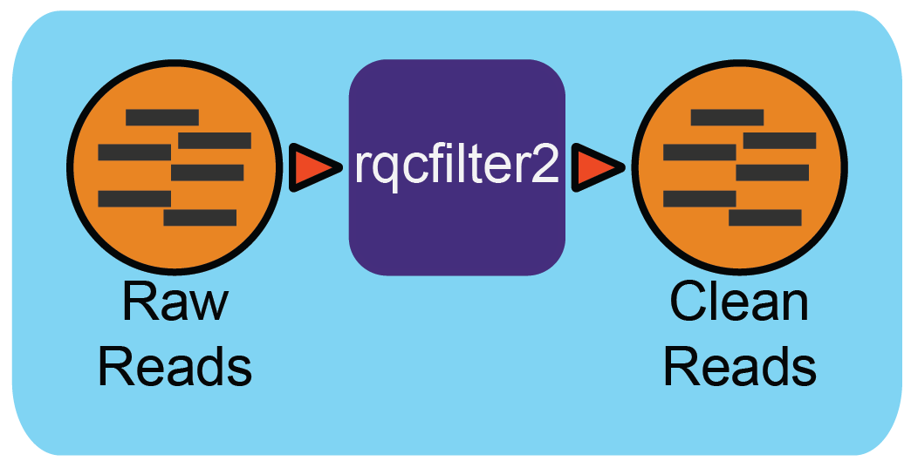

Reads QC Workflow (v1.0.2)
=============================

Workflow Overview
-----------------

This workflow utilizes the program "rqcfilter2" from BBTools to perform quality control on raw Illumina reads. The workflow performs quality trimming, artifact removal, linker trimming, adapter trimming, and spike-in removal (using BBDuk), and performs human/cat/dog/mouse/microbe removal (using BBMap).

The following parameters are used for "rqcfilter2" in this workflow:
    - barcodefilter=false :  Disable improper barcodes filter
    - chastityfilter=false:  Remove illumina reads failing chastity filter.
    - clumpify=true       :  Run clumpify; all deduplication flags require this.
    - extend=false        : Extend reads during merging to allow insert size estimation of non-overlapping reads.
    - jni=true             : Enable C code for higher speed and identical results.
    - usejni=false        : Do alignments in C code, which is faster, if an edit distance is allowed. This will require compiling the C code; details are in /jni/README.txt.
    - khist=true  :  Generate a kmer-frequency histogram of the output data.
    - maq=10       :  Reads with average quality (before trimming) below this will be discarded.
    - maxns=1     :  Reads with more Ns than this will be discarded.
    - minlen=51   :  Reads shorter than this after trimming will be discarded. Pairs will be discarded only if both are shorter.
    - mlf=0.33    :  Reads shorter than this fraction of original length after trimming will be discarded.
    - mtst=true    : Spike-in bbduk removal mtst parameter 
    - phix=true   :  Remove reads containing phiX kmers.
    - pigz=true    : Use pigz for compression
    - qtrim=r     :  Quality-trim from right ends before mapping.
    - removecat=true      :  Remove cat reads via mapping.
    - removedog=true      :  Remove dog reads via mapping.
    - removehuman=true    :  Remove human reads via mapping.
    - removemicrobes=true :  Remove common contaminant microbial reads via mapping, and place them in a separate file.
    - removemouse=true    :  Remove mouse reads via mapping.
    - removeribo=true      : Remove ribosomal reads via kmer-matching, and place them in a separate file.
    - **rna=true**         : Parameter for RNA-seq analysis. 
    - sketch=true          : Run SendSketch on 2M read pairs.
    - trimfragadapter=true:  Trim all known Illumina adapter sequences, including TruSeq and Nextera.
    - trimq=0     :  Trim quality threshold.
    - trimpolyg=5 :  Trim reads that start or end with a G polymer at least this long.
    - unpigz=t     : Use pigz for decompression

 
Workflow Availability
---------------------

The workflow from GitHub uses all the listed docker images to run all third-party tools.
The workflow is available in GitHub: https://github.com/microbiomedata/metaT_ReadsQC; the corresponding
Docker image is available in DockerHub: https://hub.docker.com/r/microbiomedata/bbtools.

Requirements for Execution 
--------------------------

(recommendations are in **bold**) 

- WDL-capable Workflow Execution Tool (**Cromwell**)
- Container Runtime that can load Docker images (**Docker v2.1.0.3 or higher**) 

Hardware Requirements
---------------------

- Disk space: 106 GB for the RQCFilterData database 
- Memory: >40 GB RAM

Workflow Dependencies
---------------------

Third party software (This is included in the Docker image.)  
~~~~~~~~~~~~~~~~~~~~~~~~~~~~~~~~~~~~~~~~~~~~~~~~~~~~~~~~~~~~

- `BBTools v38.96 <https://jgi.doe.gov/data-and-tools/bbtools/>`_ (License: `BSD-3-Clause-LBNL <https://bitbucket.org/berkeleylab/jgi-bbtools/src/master/license.txt>`_)

Requisite database
~~~~~~~~~~~~~~~~~~

The RQCFilterData Database must be downloaded and installed. This is a 106 GB tar file which includes reference datasets of artifacts, adapters, contaminants, the phiX genome, and some host genomes.  

The following commands will download the database:: 

    mkdir refdata
    wget http://portal.nersc.gov/dna/microbial/assembly/bushnell/RQCFilterData.tar
    tar -xvf RQCFilterData.tar -C refdata
    rm RQCFilterData.tar	

Sample dataset(s)
-----------------

- Bulk soil microbial communities from the East River watershed near Crested Butte, Colorado, United States - ER_122 (`SRR8552838 <https://www.ebi.ac.uk/biosamples/samples/SAMN10864150>`_)` with `metadata available in the NMDC Data Portal <https://data.microbiomedata.org/details/study/nmdc:sty-11-dcqce727>`_

Inputs
------

A JSON file containing the following information: 

1.	the path to the database
2.	the path to the interleaved fastq file (input data) 
3.	the path to the output directory
4.      input_interleaved (boolean)
5.      forwards reads fastq file (when input_interleaved is false) 
6.      reverse reads fastq file (when input_interleaved is false)     
7.	(optional) parameters for memory 
8.	(optional) number of threads requested

An example input JSON file is shown below:

.. code-block:: JSON

    {
        "metaTReadsQC.input_files": ["/global/cfs/cdirs/m3408/test_data/metatranscriptome/antisense/52400.2.318150.GATACTGG-CCAGTATC.fastq.gz"],
        "metaTReadsQC.proj":"nmdc:xxxxxxx",
        "metaTReadsQC.rqc_mem": 180,
        "metaTReadsQC.rqc_thr": 64,
        "metaTReadsQC.database": "/refdata/"

    }
.. note::

    In an HPC environment, parallel processing allows for processing multiple samples. The "jgi_rqcfilter.input_files" parameter is an array data structure. It can be used for multiple samples as input separated by a comma (,).
    Ex: "jgi_rqcfilter.input_files":[“first-int.fastq”,”second-int.fastq”]

Output
------

A directory named with the prefix of the FASTQ input file will be created and multiple output files are generated; the main QC FASTQ output is named prefix.anqdpht.fastq.gz. Using the dataset above as an example, the main output would be named SRR7877884-int-0.1.anqdpht.fastq.gz. Other files include statistics on the quality of the data; what was trimmed, detected, and filtered in the data; a status log, and a shell script documenting the steps implemented so the workflow can be reproduced.

An example output JSON file (filterStats.json) is shown below:
   
.. code-block:: JSON 
    
	{
	  "inputReads": 331126,
	  "kfilteredBases": 138732,
	  "qfilteredReads": 0,
	  "ktrimmedReads": 478,
	  "outputBases": 1680724,
	  "ktrimmedBases": 25248,
	  "kfilteredReads": 926,
	  "qtrimmedBases": 0,
	  "outputReads": 11212,
	  "gcPolymerRatio": 0.182857,
	  "inputBases": 50000026,
	  "qtrimmedReads": 0,
	  "qfilteredBases": 0
	}

Below is an example of all the output directory files with descriptions to the right.

==================================== ============================================================================
FileName                              Description
==================================== ============================================================================
nmdc_xxxxxx.fastq.gz                  main output (clean data)       
adaptersDetected.fa                   adapters detected and removed        
bhist.txt                             base composition histogram by position 
cardinality.txt                       estimation of the number of unique kmers 
commonMicrobes.txt                    detected common microbes 
file-list.txt                         output file list for rqcfilter2.sh 
filterStats.txt                       summary statistics 
filterStats.json                      summary statistics in JSON format 
filterStats2.txt                      more detailed summary statistics 
gchist.txt                            GC content histogram 
human.fq.gz                           detected human sequence reads 
ihist_merge.txt                       insert size histogram 
khist.txt                             kmer-frequency histogram 
kmerStats1.txt                        synthetic molecule (phix, linker, lamda, pJET) filter run log  
kmerStats2.txt                        synthetic molecule (short contamination) filter run log 
ktrim_kmerStats1.txt                  detected adapters filter run log 
ktrim_scaffoldStats1.txt              detected adapters filter statistics 
microbes.fq.gz                        detected common microbes sequence reads 
microbesUsed.txt                      common microbes list for detection 
peaks.txt                             number of unique kmers in each peak on the histogram 
phist.txt                             polymer length histogram 
refStats.txt                          human reads filter statistics 
reproduce.sh                          the shell script to reproduce the run
scaffoldStats1.txt                    detected synthetic molecule (phix, linker, lamda, pJET) statistics 
scaffoldStats2.txt                    detected synthetic molecule (short contamination) statistics 
scaffoldStatsSpikein.txt              detected skipe-in kapa tag statistics 
sketch.txt                            mash type sketch scanned result against nt, refseq, silva database sketches.  
spikein.fq.gz                         detected skipe-in kapa tag sequence reads 
status.log                            rqcfilter2.sh running log 
synth1.fq.gz                          detected synthetic molecule (phix, linker, lamda, pJET) sequence reads 
synth2.fq.gz                          detected synthetic molecule (short contamination) sequence reads 
==================================== ============================================================================

Version History
---------------

- 1.0.2 (release date **04/09/2021**; previous versions: 1.0.1)

Point of contact
----------------

- Original author: Brian Bushnell <bbushnell@lbl.gov>

- Package maintainer: Chienchi Lo <chienchi@lanl.gov>

