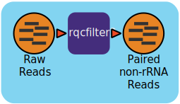

:github_url: https://github.com/microbiomedata/metaT_ReadsQC/blob/main/docs/index.rst

..
   Note: The above `github_url` field is used to force the target of the "Edit on GitHub" link
         to be the specified URL. That makes it so the link will work, regardless of the Sphinx
         site the file is incorporated into. You can learn more about the `github_url` field at:
         https://sphinx-rtd-theme.readthedocs.io/en/stable/configuring.html#confval-github_url

MetaT Reads QC Workflow (v0.0.7)
=============================

Workflow Overview
-----------------

This workflow utilizes the program "rqcfilter2" from BBTools to perform quality control on raw Illumina reads. The workflow performs quality trimming, artifact removal, linker trimming, adapter trimming, and spike-in removal (using BBDuk), and performs human/cat/dog/mouse/microbe removal (using BBMap). It is a replicate of the `QA protocol <https://jgi.doe.gov/data-and-tools/software-tools/bbtools/bb-tools-user-guide/data-preprocessing/>`_ implemented at JGI.

The following parameters are used for "rqcfilter2" in this workflow:
 
.. list-table:: 
   :header-rows: 1

   * - :code:`Parameter`
     - Description
   * - :code:`barcodefilter=false`
     - Disable improper barcodes filter
   * - :code:`chastityfilter=false`
     - Remove illumina reads failing chastity filter
   * - :code:`clumpify=true`
     - Run clumpify; all deduplication flags require this
   * - :code:`extend=false`
     - Extend reads during merging to allow insert size estimation of non-overlapping reads
   * - :code:`jni=true`
     - Enable C code for higher speed and identical results
   * - :code:`usejni=false`
     - Do alignments in C code, which is faster, if an edit distance is allowed. This will require compiling the C code
   * - :code:`khist=true`
     - Generate a kmer-frequency histogram of the output data
   * - :code:`maq=10`
     - Reads with average quality (before trimming) below this will be discarded
   * - :code:`maxns=1`
     - Reads with more Ns than this will be discarded
   * - :code:`minlen=51`
     - Reads shorter than this after trimming will be discarded. Pairs will be discarded only if both are shorter
   * - :code:`mlf=0.33`
     - Reads shorter than this fraction of original length after trimming will be discarded
   * - :code:`mtst=true`
     - Spike-in bbduk removal mtst parameter
   * - :code:`phix=true`
     - Remove reads containing phiX kmers
   * - :code:`pigz=true`
     - Use pigz for compression
   * - :code:`qtrim=r`
     - Quality-trim from right ends before mapping
   * - :code:`removecat=true`
     - Remove cat reads via mapping
   * - :code:`removedog=true`
     - Remove dog reads via mapping
   * - :code:`removehuman=true`
     - Remove human reads via mapping
   * - :code:`removemicrobes=true`
     - Remove common contaminant microbial reads via mapping, and place them in a separate file
   * - :code:`removemouse=true`
     - Remove mouse reads via mapping
   * - :code:`removeribo=true`
     - Remove ribosomal reads via kmer-matching, and place them in a separate file
   * - :code:`rna=true`
     - *Parameter for RNA-seq analysis* (this is main difference between `ReadsQC <https://github.com/microbiomedata/ReadsQC>`_ and MetaT ReadsQC)
   * - :code:`sketch=true`
     - Run SendSketch on 2M read pairs
   * - :code:`trimfragadapter=true`
     - Trim all known Illumina adapter sequences, including TruSeq and Nextera
   * - :code:`trimq=0`
     - Trim quality threshold
   * - :code:`trimpolyg=5`
     - Trim reads that start or end with a G polymer at least this long
   * - :code:`unpigz=t`
     - Use pigz for decompression

 
Workflow Availability
---------------------

The workflow from GitHub uses all the listed docker images to run all third-party tools.
The workflow is available in GitHub: https://github.com/microbiomedata/metaT_ReadsQC; the corresponding Docker images are available in DockerHub: 

- `microbiomedata/bbtools:38.96 <https://hub.docker.com/r/microbiomedata/bbtools>`_
- `microbiomedata/workflowmeta:1.1.1 <https://hub.docker.com/r/microbiomedata/workflowmeta>`_

Requirements for Execution 
--------------------------

(recommendations are in *italics*) 

- WDL-capable Workflow Execution Tool (*Cromwell*)
- Container Runtime that can load Docker images (*Docker v2.1.0.3 or higher*) 

Hardware Requirements
---------------------

- Disk space: 106 GB for the RQCFilterData database 
- Memory: >40 GB RAM

Workflow Dependencies
---------------------

Third party software (This is included in the Docker image.)  
~~~~~~~~~~~~~~~~~~~~~~~~~~~~~~~~~~~~~~~~~~~~~~~~~~~~~~~~~~~~

- `BBTools v38.96 <https://jgi.doe.gov/data-and-tools/bbtools/>`_ (License: `BSD-3-Clause-LBNL <https://bitbucket.org/berkeleylab/jgi-bbtools/src/master/license.txt>`_)

Requisite database
~~~~~~~~~~~~~~~~~~

The RQCFilterData Database must be downloaded and installed. This is a 106 GB tar file which includes reference datasets of artifacts, adapters, contaminants, the phiX genome, and some host genomes.  

The following commands will download the database 

.. code-block::bash
    mkdir refdata
    wget http://portal.nersc.gov/dna/microbial/assembly/bushnell/RQCFilterData.tar
    tar -xvf RQCFilterData.tar -C refdata
    rm RQCFilterData.tar	

Sample datasets
---------------
- Processed Metatranscriptome of soil microbial communities from the East River watershed near Crested Butte, Colorado, United States - ER_RNA_119 (`SRR11678315 <https://www.ncbi.nlm.nih.gov/sra/SRX8239222>`_) with `metadata available in the NMDC Data Portal <https://data.microbiomedata.org/details/study/nmdc:sty-11-dcqce727>`_. 

  - The zipped raw fastq file is available `here <https://portal.nersc.gov/project/m3408//test_data/metaT/SRR11678315/SRR11678315.fastq.gz>`_
  - The qc'ed outputs are available `here <https://portal.nersc.gov/cfs/m3408/test_data/metaT/SRR11678315/readsqc_output/>`_

Inputs
------

A JSON file containing the following information: 

#.	the path to the database directory
#.	the path to the fastq file(s) ([R1, R2] if not interleaved) 
#.  input_interleaved (boolean)
#.  output file prefix
#.	(optional) parameters for memory 
#.	(optional) number of threads requested

An example input JSON file is shown below:

.. code-block:: JSON

    {
        "metaTReadsQC.input_files": ["https://portal.nersc.gov/project/m3408//test_data/metaT/SRR11678315.fastq.gz"],
        "metaTReadsQC.proj":"SRR11678315-int-0.1",
        "metaTReadsQC.rqc_mem": 180,
        "metaTReadsQC.rqc_thr": 64,
        "metaTReadsQC.database": "/refdata/"

    }

Output
------

In the workflow execution directories, there will be a folder called :code:`filtered` containing all the below listed output files. The bolded outputs below will be copied over to the primary output folder for the full workflow. The :code:`rqcfilter2.sh` output is named :code:`raw.anqdpht.fastq.gz`. Using the dataset above as an example, the main output would be renamed :code:`SRR11678315-int-0.1.filtered.fastq.gz`. Other files include statistics on the quality of the data; what was trimmed, detected, and filtered in the data; a status log, and a shell script documenting the steps implemented so the workflow can be reproduced.

An example output JSON file (filterStats.json) is shown below:
   
.. code-block:: JSON 
    
    {
        "inputReads": 16809276, 
        "kfilteredBases": 4500, 
        "qfilteredReads": 3978, 
        "ktrimmedReads": 467761, 
        "outputBases": 1473400259, 
        "ktrimmedBases": 60463632, 
        "kfilteredReads": 15, 
        "qtrimmedBases": 2345, 
        "outputReads": 4974016, 
        "gcPolymerRatio": 112.898477, 
        "inputBases": 5076401352, 
        "qtrimmedReads": 292, 
        "qfilteredBases": 1185765
    }

Below is an example of all the :code:`filtered` output directory files from :code:`rqcfilter2.sh` with descriptions to the right. The *italicized* files are selected for output through NMDC-EDGE. 

.. list-table:: 
   :header-rows: 1

   * - Directory/File Name
     - Description
   * - *raw.anqrpht.fastq.gz*
     - main output (clean data)
   * - rRNA.fastq.gz
     - filtered ribosomal reads
   * - adaptersDetected.fa
     - adapters detected and removed
   * - bhist.txt
     - base composition histogram by position
   * - cardinality.txt
     - estimation of the number of unique kmers
   * - commonMicrobes.txt
     - detected common microbes
   * - file-list.txt
     - output file list for rqcfilter2.sh
   * - *filterStats.txt*
     - *summary statistics*
   * - *filterStats.json*
     - *summary statistics in JSON format*
   * - *filterStats2.txt*
     - *more detailed summary statistics*
   * - gchist.txt
     - GC content histogram
   * - human.fq.gz
     - detected human sequence reads
   * - ihist_merge.txt
     - insert size histogram
   * - khist.txt
     - kmer-frequency histogram
   * - kmerStats1.txt
     - synthetic molecule (phix, linker, lamda, pJET) filter run log
   * - kmerStats2.txt
     - synthetic molecule (short contamination) filter run log
   * - ktrim_kmerStats1.txt
     - detected adapters filter run log
   * - ktrim_scaffoldStats1.txt
     - detected adapters filter statistics
   * - microbes.fq.gz
     - detected common microbes sequence reads
   * - microbesUsed.txt
     - common microbes list for detection
   * - peaks.txt
     - number of unique kmers in each peak on the histogram
   * - phist.txt
     - polymer length histogram
   * - refStats.txt
     - human reads filter statistics
   * - reproduce.sh
     - the shell script to reproduce the run
   * - scaffoldStats1.txt
     - detected synthetic molecule (phix, linker, lamda, pJET) statistics
   * - scaffoldStats2.txt
     - detected synthetic molecule (short contamination) statistics
   * - scaffoldStatsSpikein.txt
     - detected spike-in kapa tag statistics
   * - sketch.txt
     - mash type sketch scanned result against nt, refseq, silva database sketches
   * - spikein.fq.gz
     - detected spike-in kapa tag sequence reads
   * - status.log
     - rqcfilter2.sh running log
   * - synth1.fq.gz
     - detected synthetic molecule (phix, linker, lamda, pJET) sequence reads
   * - synth2.fq.gz
     - detected synthetic molecule (short contamination) sequence reads

Version History
---------------

- 0.0.7 (release date *08/23/2024*; previous versions: 0.0.6)

Point of contact
----------------

- Original author: Brian Bushnell <bbushnell@lbl.gov>

- Package maintainers: Samantha Obermiller samantha.obermiller@pnnl.gov
